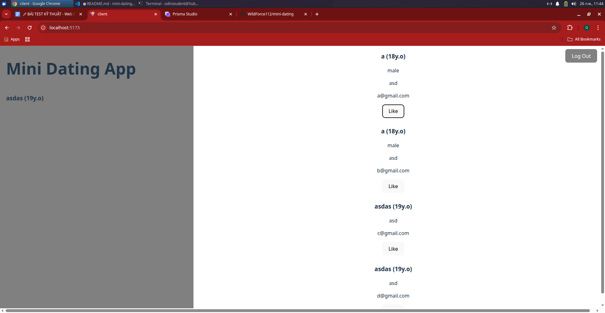
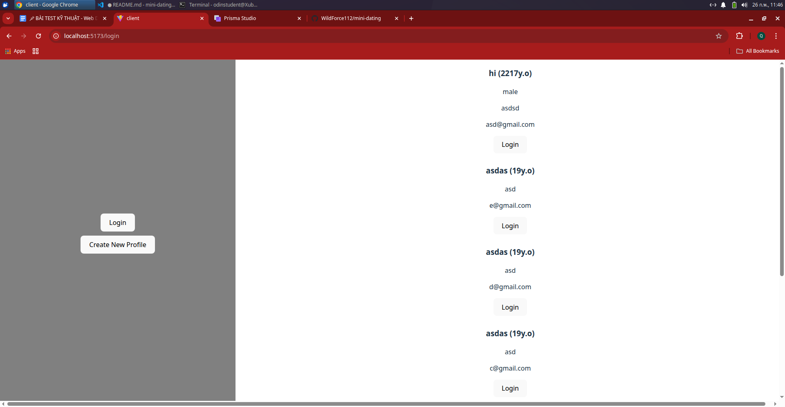
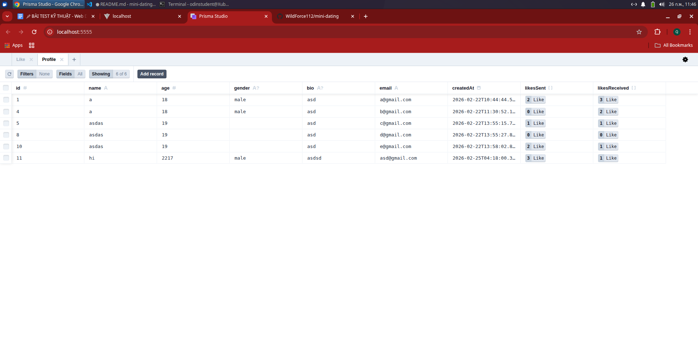
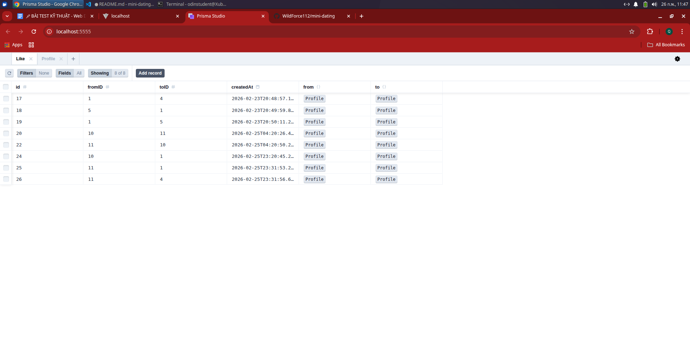

# Mini Dating App

## Giới thiệu
Mini Dating là một ứng dụng web đơn giản cho phép người dùng tạo profile, xem danh sách người khác, gửi "Like" và tạo "Match" khi hai người thích nhau.

Ứng dụng có 2 phần:

- **client/** – giao diện frontend React
- **server/** – backend logic (chưa deploy ra public)

Frontend hiện tại mới làm xong phần tạo grid và UI hiển thị danh sách người, chưa hoàn chỉnh phần logic match.

---

## Cách tổ chức hệ thống
mini-dating/  
├── client/ # Frontend React  
│ ├── public/  
│ └── src/  
│ ├── components/  
│ └── pages/  
├── server/ # Backend (Express / NodeJS)  
│ ├── controllers/  
│ ├── models/  
│ └── routes/  
└── README.md  

- **client/** chứa toàn bộ React app UI
- **server/** là REST API backend xử lý logic match, slot trùng và lưu dữ liệu
- Dự án sử dụng cấu trúc `client / server` để tách rời UI và backend

---

## Bạn lưu data bằng gì?
Hiện tại dữ liệu được lưu **tạm trong memory / local storage (UI)**  
Backend có model dữ liệu nhưng **chưa deploy database thực tế**.

- Frontend: nếu cần, data demo được lưu bằng **localStorage**
- Backend: models có định nghĩa để kết nối database sau này

## Logic match hoạt động thế nào
> Hiện tại phần logic match chỉ mới *ý tưởng*, chưa hoàn chỉnh trong bản này.

Logic match dự kiến hoạt động như sau:

1. Người dùng chọn ngày trống (available dates) và thời gian sẵn sàng
2. Mỗi profile sẽ có một danh sách ngày/khung giờ rảnh
3. Khi match, hệ thống so sánh ngày & giờ trùng nhau
4. Nếu tìm thấy ngày & giờ khớp, sẽ xem là **match**

---

## Logic tìm slot trùng hoạt động thế nào

Hiện tại UI đã hiển thị grid ngày giờ rảnh nhưng:

- Chưa xây logic so khớp giữa 2 người
- Chưa gọi backend để so sánh

**Ý tưởng logic:**

For each slot in userA.slots:  
For each slot in userB.slots:  
If slot.date == slot2.date and slot.time == slot2.time:  
matchedSlots.push(slot)  

Nếu có ngày giờ trùng → hiển thị kết quả match.

---

## 📸 Screenshots (thay cho live demo)

